# MSI-Project

Apprentissage de représentations d’images par approche auto-suppervisée avec DinoV2. 

Dans le cadre du Master 2 VMI de l'Université Paris Cité. L’objectif de ce projet est d’adapter DinoV2 afin d’apprendre des représentations d’images pour effectuer des recherche de plus proches voisins dans un dataset spécifique. Le dataset est composé de 47 000 images historiques, annotées pour la plupart avec une légende et une description, composée de mots clés. Les images ont été prétraitées et sont de taille 256 * 256. 

Ma démarche a été la suivante : entrainer un modèle DinoV2 “from scratch” et le comparer à Dino et à des modeles obtenus par fine-tuning de Dino. 

Première étape : entrainement d’un modèle from scratch 

Le script training_from_scratch.py est le script utilisé pour l’entrainement. Il définit le backbone et le head utilisé en définissant un student et un teacher. Puisque l’on est dans le cadre d’un entrainement d’un modèle auto-suppervisé et que je dispose de peu de données, j’ai fait le choix d’utiliser tout mon dataset pour l’entrainement. Je suis d’abord pasé par une étape de recherche des meilleurs hyper-parmetres afin de trouver le learning rate le plus adapté. Le script hyperparameters.py m’a permis de réaliser cela.  

 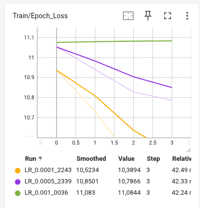
 

Courbe d’apprentissage de mon modèle :  
 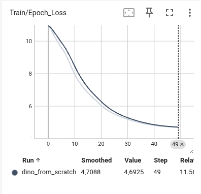

Une fois ce modèle obtenue, je me suis penché sur le fine-tuning de DinoV2. Pour cela, je télécharge le backbone officiel :  

official_backbone = torch.hub.load('facebookresearch/dinov2', 'dinov2_vits14') 

 

Ensuite, j’ai voulu comparer la performance des modeles suivant le nombre de couches gelées. Pour cela, mon premier modele fine-tune ne réentraine que la  couche 11 et la dernière (couche de normalisation), alors que deuxième réentraine en plus les couches 9 et 10. 

Comparaison des loss du head et du backbone pour les deux fine-tuning :  

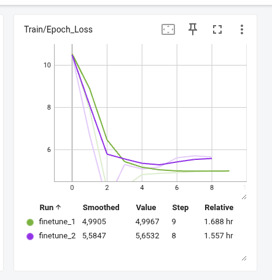

Et comparaison de la loss globale :  

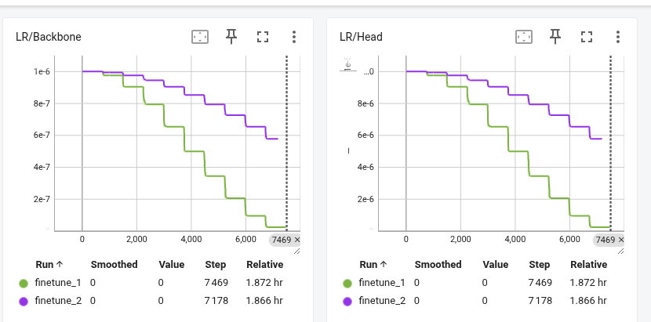
 
 

J’ai utiilsé des learning rates différents entre le head et le backbone, afin que le head apprenne vite et pour ne pas détériorer les poids de DinoV2 sur backbone.  
 

Une fois ces modèles appris, j’ai voulu effectuer une tâche de recherche du plus proche voisin et évaluer les modèles. Je rajoute à ces 4 modeles (mon modele from scratch, DINOV2 et mes deux modèles fine-tuné), un modèle avec les poids de DINOV2 mis aléatoirement, afin de comparer les résultats globaux.  

Une première étape est d’éffectuer une recherche des plus proches voisins.  
Pour cela, pour une image donnée, j’en extrait un embedding à travers un modèle puis je compare sa similarité cosinus avec les autres images pour en obtenir les plus proches voisins. J’effectue ceci pour tous mes modèles. En voici quelques résultats :  

 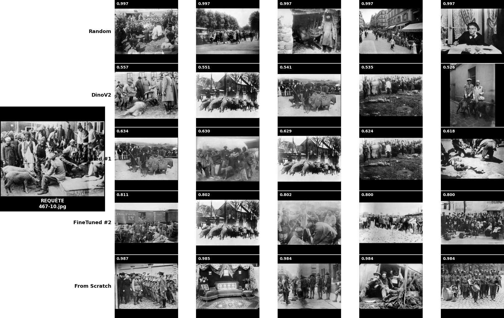
 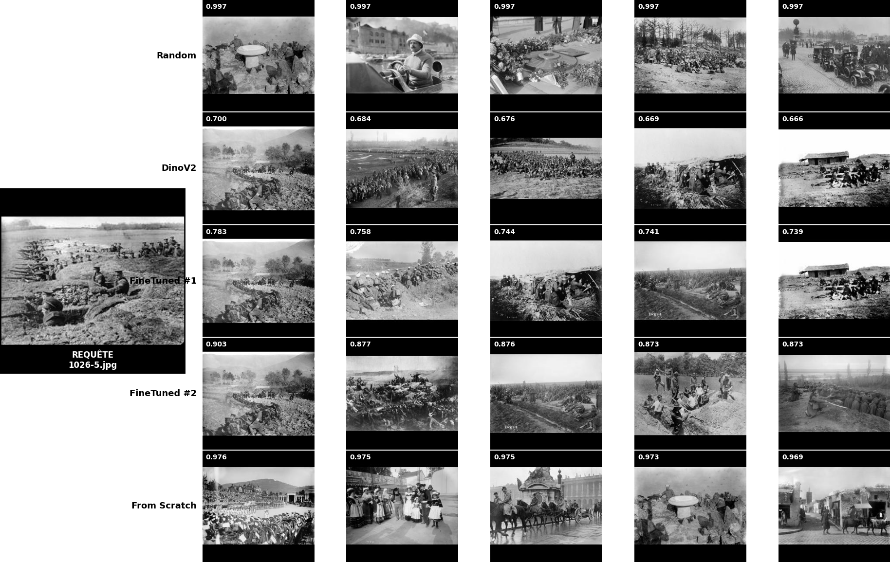
 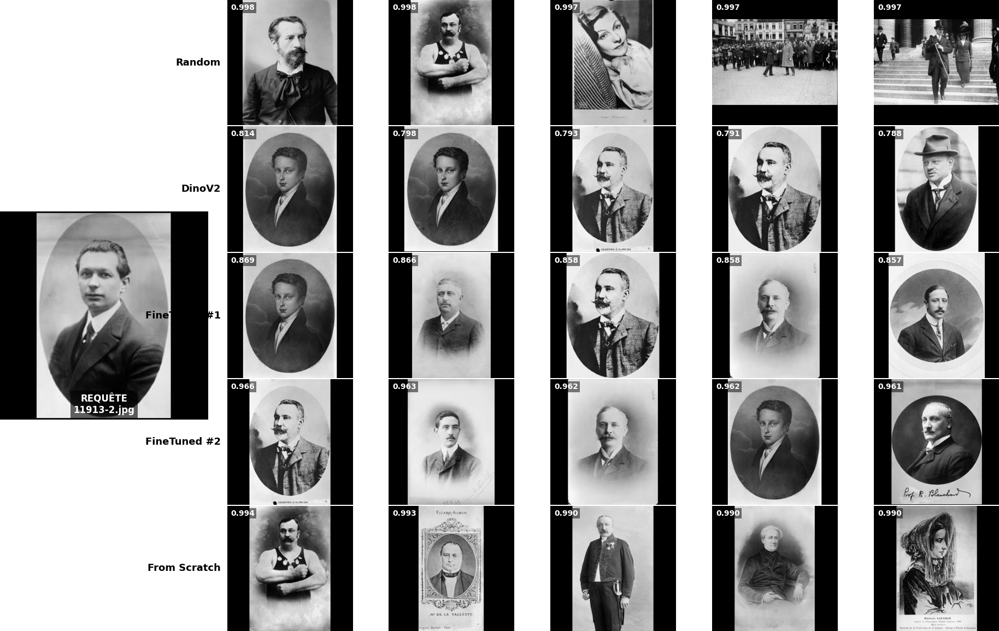

 
Les modèles les plus performants sont bien sûr DIinoV2 et les deux modèles fine-tuné. Les scores de similarité pour le modèle aléatoire et le from scratch sont pourtant élevé, mais on note que les images n’ont rien à voir avec celle de référence. Sans doute car, plutôt que d’apprendre des caractéristique, mo modèle se concentre sur les bandes noires et les couleurs, d’où le score élevé. 

Une chose intéressante à effectuer ensuite et de visualier les cartes d’attention, pour voir ce qu’”observe” les modèles. En voici quelque exemples, obtenus via visualize_attention.py :  

 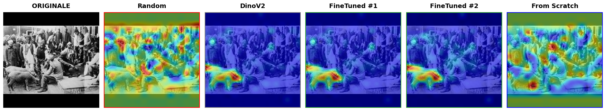
 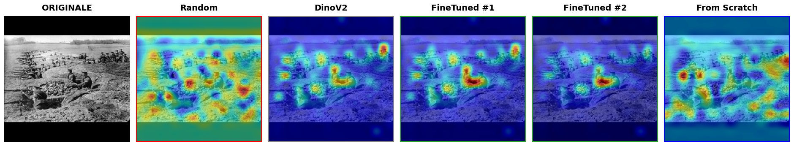
 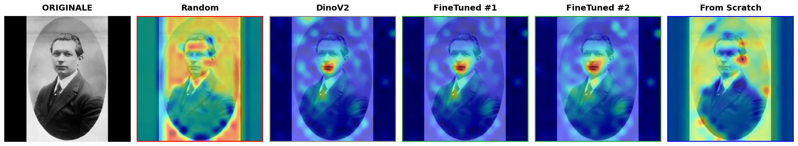
 

Les cartes d’attention confirment bien que le modèle from scratch se concentre sur les couleurs et les bandes noires, contrairement aux modèles plus puissants qui se focalisent sur l’objet principale de la photo. 

La dernière a été de calculer le score de Spearman afin d'évaluer les performances des modèles. Pour cela, j'utilise un encoder textuel SBERT afin d'obtenir un embedding pour les légendes et pour les descripteurs, voici les résultats obtenus avec les embeddings des légendes :

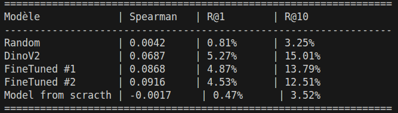

et ceux des descripteurs :
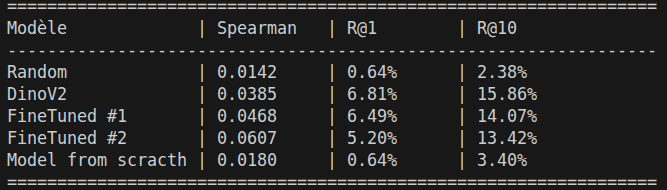

Les scores sont bas mais cohérents, car les modèles DinoV2 et ceux fine-tuned ont des scores bein au-dessus. De façon assez surprenante, c'est DinoV2 qui a les meilleurs scores. Cela s'explique peut être par une alteration des poids du à mon entrainement ou à une meilleur généralisation de la sémantique de la part de Dino.

En conclusion, les représentations d'images par modele auto-suppervisé sont tèrs bonne. Une difficulté réside dans le fait d'évaluer correctement les modèles. Une autre étape pourrait être de comparer Dino à d'autres modèles auto-suppervisés mais aussi de voir comment réagit DinoV2 en améliorant sa sémantique, plutôt que de seulement comparer des embeddings textuels et images.
